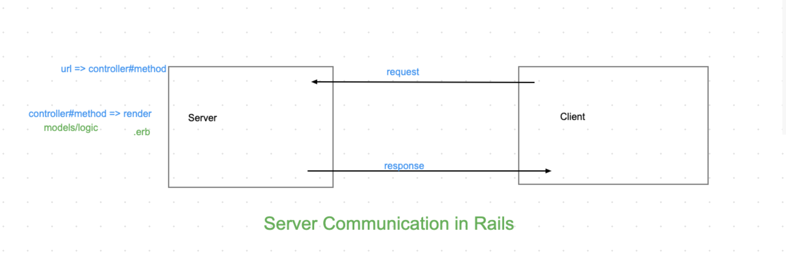

# ajax_fetch_intro
A sample lecture for an intro to AJAX and fetch requests

Canon: we already know DOM elements, create DOM elements and creating event listeners for said events

Communication? 

Everything in  life is communicating. In Mod 2 we went over our request response cycle, we are going to borrow some of that knowledge to use for this lesson. By the end, you will be able to describe AJAX and write a fetch request. 

So far in Javascript we have learned to manipulate the DOM, we can grab Elements already on our index.html, create new Elements, change the text or other data in that Element and attach it to the DOM. 
The next part is crucial to know how modern web applications access and populate their data. 
Let's take facebook for example, we log in and we see our tiimeline, our timeline has a _bunch_ of information. That iis a LOT of code to create an element for, change inner text and append to.  

What does a cycle in server communication look like? 

So lets consider conversation

Format: 

