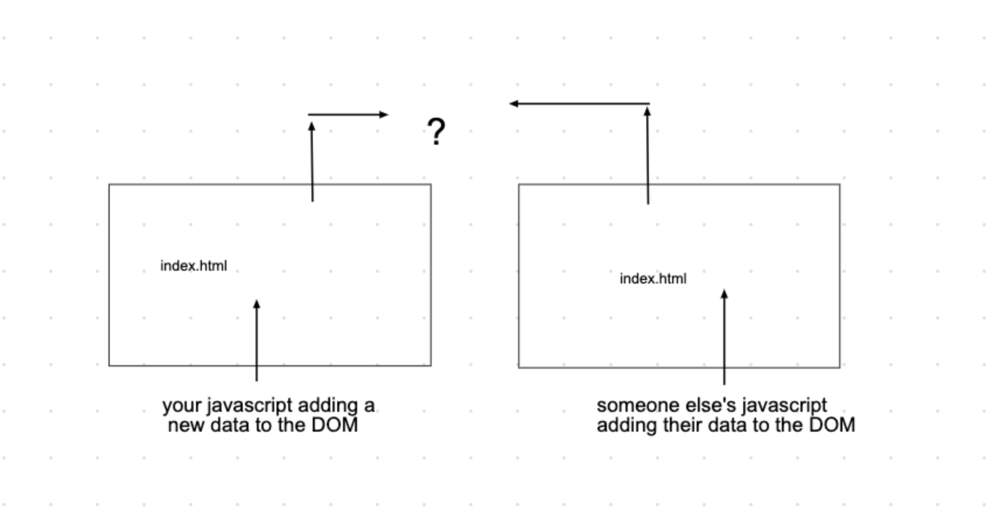

# ajax_fetch_intro
A sample lecture for an intro to AJAX and fetch requests

Canon: we already know DOM elements, create DOM elements and creating event listeners for said events

# Learning Goals: By the end of this we should be able to: 
                [] Describe the importance of a backend in the context of web applications
                [] Write a fetch request(GET Only)

In Mod 2 we went over our request response cycle, we are going to use some of that knowledge for this lesson. 
By the end, you will be able to describe AJAX and write a fetch request. 

## where are we at so far?? 

So far in Javascript we have learned to manipulate the DOM, we can grab Elements already on our index.html, create new Elements, change the text or other data in that Element and attach it to the DOM. But we can't really see our changes between our code. The modern web application takes full advantage of the stack. 
The next part is crucial to know how modern web applications access and populate their data. 

 

                we can make changes to our DOM, but we still are not *persisting* our data
                by the end this we would be closing the loop

## ok but why? 

Lets consider Facebook, Instagram, Twitter

There's a lot of people on facebook and we as developers can *not* stay writing javascript for every single user. So where does this data come from, if it's not hardcoded or in dynamic javascript yet? 

## *Servers Connected to Databases* 
Correct, we have data lying around in a database that can be accessed through a server given a url. We as developers want to express data in a meaningful way. 

What does a cycle in server communication look like? 

So lets consider Mod2 Communication between servers:

With more detail here: 

Why is any of this important? 
Lets consider Facebook

There's a lot of people on facebook and we as developers can *not* stay writing javascript for every single user. So where does this data come from, if it's not hardcoded or in dynamic javascript yet? 

*Databases* 
Correct, we have data lying around in a database that can be accessed through a server given a url. 
We need a _a central server that processes requests from many clients_

Hold on to the idea of a server, because the concept is important. We are going to be focusing on _accessing_ this information before we set up our own server to handle data. Introducing *json-server* 

                npm i -g json-server //the line you write in your terminal to install the npm package
                json-server --watch <your_file.json>

This npm package will _mimic_ our server for us so we can practice accessing this data

## a step back

AJAX, stands for Asynchronous Javascript and XML, the term was coined sometime in the early 2000's. It's the tecnique in which several technologies come together to allow web applications to make quick, incremental updates to the user interface without reloading the entire browser page

-Fetch API
The fetch API provides an interface that allows us to access resources across servers.
[FETCH API DOCUMENTATION](https://developer.mozilla.org/en-US/docs/Web/API/Fetch_API)

                fetch(URL,{})
                .then(res=> res.json())
                .then(data=> console.log)

