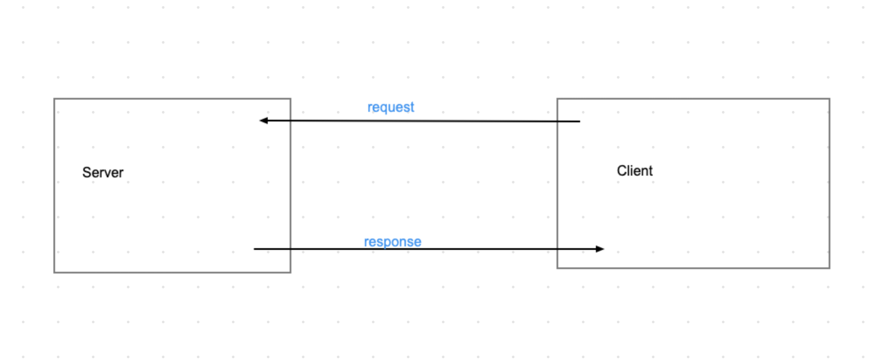

# ajax_fetch_intro
A sample lecture for an intro to AJAX and fetch requests

Canon: we already know DOM elements, create DOM elements and creating event listeners for said events

# Learning Goals: By the end of this we should be able to: 
                [] Describe the importance of a backend in the context of web applications
                [] Make a fetch request

In Mod 2 we went over our request response cycle, we are going to use some of that knowledge for this lesson. 
By the end, you will be able to describe AJAX and write a fetch request. 

## where are we at so far?? 

So far in Javascript we have learned to manipulate the DOM, we can grab Elements already on our index.html, create new Elements, change the text or other data in that Element and attach it to the DOM. 
The next part is crucial to know how modern web applications access and populate their data. 

## ok but why? 

Lets consider Facebook
Take 2 minutes, and using what we have learned in class so far lets come up with a way to build facebook.
We know how to grab elements, how to create and add to element on our HTML. 

There's a lot of people on facebook and we as developers can *not* stay writing javascript for every single user. So where does this data come from, if it's not hardcoded or in dynamic javascript yet? 

## *Servers Connected to Databases* 
Correct, we have data lying around in a database that can be accessed through a server given a url. We as developers want to express data in a meaningful way. 

What does a cycle in server communication look like? 

So lets consider Mod2 Communication between servers:

With more detail here: 

Why is any of this important? 
Lets consider Facebook
Lets take 2 minutes, and using what we have learned in class so far lets come up with a way to build facebook.
We know how to grab elements, how to create and add to element on our HTML. 

There's a lot of people on facebook and we as developers can *not* stay writing javascript for every single user. So where does this data come from, if it's not hardcoded or in dynamic javascript yet? 

*Databases* 
Correct, we have data lying around in a database that can be accessed through a server given a url. 

